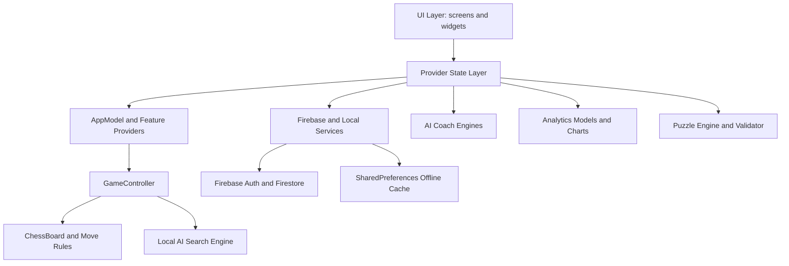

# ChessCoach AI - Project Report

## 1. Problem Understanding

Chess apps often focus on only one part of the learning loop: either playing games, solving puzzles, or reviewing statistics. ChessCoach AI was built around a more complete training flow:

1. Play a chess game against an adaptive local AI.
2. Save and analyze the match.
3. Convert match history into meaningful progress insights.
4. Recommend what the player should improve next.
5. Support daily tactical practice through puzzles.

The target user is a casual-to-intermediate chess learner who wants more than a basic board, but does not want to use separate tools for gameplay, puzzles, analytics, and review.

## 2. Product Goal

The goal of ChessCoach AI is to act as a mobile chess training companion. The app combines a playable chess board, rule-based AI opponent, Firebase-backed account system, offline-first data handling, analytics dashboard, puzzle system, replay review, and personalized coaching recommendations.

This project intentionally avoids looking like a generic template app. The visual style, interaction patterns, chess board rendering, analytics cards, coach summaries, and puzzle screens were customized for the identity of a serious chess training product.

## 3. Core Features

### Authentication

- Email/password sign up.
- Email/password login.
- Password reset.
- Firebase Auth-backed user identity.
- Auth gate that decides whether to show login/signup or the main application.

### Chess Gameplay

- Single-player mode against a local AI.
- Local two-player mode.
- Side selection: white, black, or random.
- Optional time controls.
- Move hints, latest-move highlights, check indicators, and move history.
- Undo/redo support when enabled.
- Promotion handling.
- Saved-game restore support.
- Audio feedback for moves and game results.

### AI Opponent

- 5 difficulty levels.
- Local chess search engine.
- Minimax with alpha-beta pruning.
- Iterative deepening.
- Quiescence search.
- Null-move pruning.
- Late-move reductions.
- Transposition table support.
- Opening-line support.

### Daily Puzzle System

- Daily puzzle screen.
- Puzzle solution validation using UCI move notation.
- XP rewards.
- Streak tracking.
- Hints.
- Rating, category, and difficulty metadata.
- Puzzle progress persistence.

### Analytics

- Total games, wins, losses, draws.
- Win rate.
- Current streak.
- Average game duration.
- Difficulty-level performance.
- Recent match history.
- Insight generation from match data.

### AI Coach

- Personalized summary based on completed matches.
- Strengths, weaknesses, tendencies, and recommendations.
- Focus areas based on color performance, game phase, AI difficulty, opening family, pace, aggression, and defensive style.
- Cached coach insights for offline usage.

### Replay And Review

- Move timeline.
- Replay controls.
- Evaluation chart.
- Critical moment cards.
- Post-game review summaries.
- Move quality classification.

## 4. Meaningful Extensions Beyond Base Requirements

### Extension 1: AI Coach Insight System

The app does not only show raw match numbers. It interprets the player’s history and generates coaching cards such as:

- stronger color performance
- weak game phase
- difficulty-level progress
- pacing tendencies
- aggressive or defensive style patterns

This makes the analytics actionable instead of purely informational.

### Extension 2: Daily Puzzle Progression

The puzzle system includes XP, streaks, difficulty metadata, hints, result handling, and progress persistence. This gives users a daily habit loop beyond normal chess matches.

### Extension 3: Realtime Move Review

When coach mode is enabled, the app compares user moves against local engine estimates and classifies move quality. This adds a learning layer directly into gameplay.

## 5. Architecture Overview

The application is organized into clear layers:



### UI Layer

Located mainly in:

```text
lib/screens/
lib/widgets/
```

This layer displays screens, forms, cards, charts, chess board widgets, puzzle UI, coach UI, and reusable components.

### State Layer

Located mainly in:

```text
lib/models/app_model.dart
lib/providers/
```

Provider is used for predictable state management. Global state is kept in Provider-backed classes rather than being scattered through the UI.

### Business Logic Layer

Located mainly in:

```text
lib/logic/
lib/ai_coach/
lib/puzzles/
lib/replay/
```

This layer contains chess rules, AI search, puzzle validation, coach analysis, replay analysis, timers, audio, and saved-game logic.

### Data Layer

Located mainly in:

```text
lib/firebase/
lib/services/
lib/models/
```

This layer handles Firebase Auth, Firestore, offline cache, sync queue, and structured data models.

## 6. State Management Explanation

The project uses Provider for state management.

Important providers and state classes:

- `AppModel`: core game settings, current game state, timers, preferences, selected side, AI difficulty, and game lifecycle.
- `AuthProvider`: authentication state and auth actions.
- `MatchHistoryProvider`: saved match history.
- `AnalyticsProvider`: analytics summary generation and persistence.
- `AiCoachProvider`: match-based coach report generation and persistence.
- `RealtimeCoachProvider`: live move review state during coach mode.
- `PuzzleProvider`: daily puzzle state, attempts, progress, and rewards.
- `ConnectivityProvider`: online/offline status.

The app separates global state from temporary UI state. Local `setState()` usage is limited to UI-only interactions such as toggling password visibility, button press animation, selected puzzle square, and text-field submit availability. Core application state remains Provider-driven.

## 7. Firebase And Data Handling

Firebase is used for backend functionality:

- Firebase Auth for login, signup, password reset, and auth session state.
- Cloud Firestore for match history, analytics summaries, coach reports, puzzle attempts, and puzzle progress.
- Firestore offline persistence is enabled.
- SharedPreferences is used for local settings, saved games, cache, and sync queue.

The data is stored through structured model classes rather than untyped random JSON usage.

Example Firestore structure:

```text
users/{userId}
  match_history/{matchId}
  analytics/summary
  coach_insights/{insightId}
  ai_coach/summary
  puzzle_attempts/{attemptId}
  puzzles/progress
```

Offline behavior:

- Cached analytics and coach insights remain available.
- Settings and saved games persist locally.
- Failed sync actions can be queued and retried later.
- Offline banner and retry/no-connection UI are available.

## 8. Custom Logic Systems

### 8.1 Chess AI Engine

The chess opponent is implemented locally in:

```text
lib/logic/move_calculation/ai_move_calculation.dart
```

How it works:

1. The game controller detects that it is the AI’s turn.
2. The board, AI player, and selected difficulty are sent to a background isolate using Flutter `compute`.
3. If an opening line is available, the AI picks an opening move.
4. Otherwise, the AI searches legal moves using iterative deepening.
5. Alpha-beta pruning removes branches that cannot improve the result.
6. Quiescence search extends tactical capture sequences at leaf nodes.
7. Null-move pruning and late-move reductions improve performance.
8. The board evaluation combines material and piece-square tables.
9. The best move is returned and applied to the board.

This is a non-trivial custom logic system because it includes move generation, board evaluation, search optimization, and difficulty scaling.

### 8.2 AI Coach Engine

The AI Coach is implemented in:

```text
lib/ai_coach/
```

It analyzes match history and builds:

- performance summary
- insights
- recommendations
- strengths
- weaknesses
- tendencies

The coach considers:

- total matches
- win rate
- recent trend
- color performance
- AI difficulty performance
- opening family
- average pace
- aggressive and defensive scores
- phase of losses

This system is rule-based, transparent, and project-specific. It is not copied from a tutorial and does not depend on an external LLM.

### 8.3 Puzzle Validation And Scoring

The puzzle logic is implemented in:

```text
lib/puzzles/
lib/models/puzzle_*.dart
lib/providers/puzzle_provider.dart
```

It validates UCI moves, compares player attempts to puzzle solutions, calculates XP, tracks hints, and updates puzzle progress.

### 8.4 Analytics Calculation

Analytics are generated from match history. The app computes:

- total matches
- result counts
- win rate
- average duration
- current win streak
- performance by difficulty
- recent match list
- personalized insight strings

## 9. Data Visualization And Insight Layer

The analytics dashboard includes a difficulty performance chart using `fl_chart`.

The chart answers:

> Which AI difficulty level is the player performing best against?

This is useful because a player can identify whether they should increase difficulty, stay at the current level, or review losses at a specific level.

The app also uses visual progress indicators for:

- puzzle progress
- puzzle streaks
- coach evaluation
- loading and sync states
- replay evaluation summaries

## 10. UI/UX Customization

The app uses a custom visual identity built around a dark chess-coaching theme:

- custom color system in `lib/core/theme/app_colors.dart`
- typography hierarchy using Playfair Display and Jura-style assets
- custom cards for analytics, coach insights, puzzles, and game setup
- Flame-rendered chess board
- custom app scaffold
- custom auth controls
- custom stat cards
- custom puzzle and coach widgets

Reusable custom widgets include:

- `AppScaffold`
- `OfflineBanner`
- `SyncStatusIndicator`
- `StatCard`
- `CoachInsightCard`
- `PerformanceSummaryCard`
- `PuzzleCard`
- `PuzzleStreakCard`
- `RoundedButton`

Micro-interactions include:

- animated auth button press states
- animated screen/content transitions
- animated chess piece on dashboard
- animated board rotation
- animated coach cards and badges
- animated puzzle selection feedback

## 11. Testing And Validation

Automated tests are included in:

```text
test/chess_move_validation_test.dart
test/puzzle_validator_test.dart
test/analytics_model_test.dart
```

The tests cover:

- legal pawn movement
- blocked move validation
- undo/restore board behavior
- UCI puzzle move validation
- partial and complete puzzle solution matching
- XP calculation
- invalid puzzle attempt data
- empty analytics defaults
- win rate, streak, duration, and difficulty calculations
- analytics serialization

Latest test result provided by developer:

```text
00:23 +9: All tests passed!
```

## 12. Manual Testing Scenarios

### Happy Path

1. Create a new account.
2. Sign in.
3. Start a game against AI.
4. Make legal moves.
5. Finish the match.
6. Confirm match appears in history.
7. Open analytics and verify updated totals.
8. Open AI Coach and verify insights are generated.
9. Solve daily puzzle and verify XP/progress update.

### Authentication Edge Cases

- Invalid email format.
- Incorrect password.
- Empty email/password fields.
- Password reset flow.
- Existing account login after app restart.

### Gameplay Edge Cases

- Selecting a piece with no legal moves.
- Attempting an illegal move.
- Pawn promotion.
- Check/checkmate/stalemate.
- Undo and redo.
- Exiting and restoring a saved game.
- AI starts first when player selects black.

### Puzzle Edge Cases

- Wrong puzzle move.
- Partial solution sequence.
- Complete solution sequence.
- Hint usage.
- Daily puzzle already completed.

### Offline Edge Cases

- Login screen with no internet.
- Cached analytics while offline.
- Cached coach insights while offline.
- Sync queue behavior after reconnecting.
- Offline banner visibility.

### Empty States

- No match history.
- No analytics yet.
- No coach insights yet.
- Puzzle progress not started.

## 13. Performance Optimization

Performance considerations:

- AI move search runs in a background isolate using Flutter `compute`, preventing UI blocking.
- Provider separates state updates so the whole app does not rebuild unnecessarily.
- Flame handles board rendering efficiently.
- Board evaluation is incrementally tracked.
- Transposition table reduces repeated AI search work.
- Piece assets are bundled and preloaded.
- Firestore cache and SharedPreferences reduce unnecessary network dependence.
- UI loading states avoid frozen screens during async operations.

## 14. Deployment Readiness

The Android application identity is configured as:

```text
App name: ChessCoach AI
Application ID: com.harshvardhan.chesscoachai
Package name: en_passant
Version: 1.0.2+3
```

The APK output generated for submission:

```text
build/app/outputs/flutter-apk/app-release.apk
```

Launcher assets are configured through `flutter_launcher_icons`, and Android launcher resources are present in the platform project.

## 15. Challenges Faced

### Chess AI Performance

Searching chess positions can become expensive very quickly. To reduce lag, the AI search was moved into a background isolate and optimized with alpha-beta pruning, quiescence search, move ordering, null-move pruning, late-move reductions, and transposition tables.

### Keeping UI And Logic Separate

Chess games involve a lot of state: selected piece, legal moves, latest move, timers, promotions, move history, undo/redo, game over state, and AI turn. The project separates rendering, controller logic, and app state so the board remains maintainable.

### Offline Support

Firebase-backed apps can feel broken without a network connection. The project uses Firestore persistence, SharedPreferences caching, offline UI, and sync queue behavior to keep the app useful when connectivity changes.

### Turning Statistics Into Coaching

Raw statistics are not always helpful. The AI Coach layer was designed to interpret match history and produce practical insights such as weak phase, stronger color, pace tendencies, and difficulty-level progress.

## 16. AI Usage Disclosure

External AI assistance was used during development for:

- brainstorming README/report structure
- improving documentation clarity
- suggesting test coverage areas
- reviewing how to explain architecture and DoD compliance

The following parts were manually owned and adapted for this project:

- Flutter UI implementation
- Firebase integration
- Provider state architecture
- chess board behavior
- AI opponent search logic
- AI Coach rule system
- puzzle validation logic
- analytics models
- project-specific README and report content

No external LLM API is integrated into the app runtime. The app’s “AI” features are implemented locally through chess search algorithms and rule-based coaching logic.

## 17. Final DoD Mapping

| DoD Area | Status | Project Evidence |
|---|---:|---|
| Functional completeness | Complete | Gameplay, auth, puzzles, analytics, coach, replay |
| UI/UX customization | Complete | Custom theme, custom widgets, animations, chess-specific interface |
| State management | Complete | Provider, AppModel, feature providers |
| Firebase backend | Complete | Auth, Firestore, structured models, offline cache |
| Custom logic | Complete | Chess AI, AI Coach, puzzle scoring, analytics |
| Data visualization | Complete | Difficulty performance chart and progress indicators |
| Testing | Complete | 3 test files, 9 passing tests |
| Performance | Complete | AI isolate, optimized search, Provider separation |
| Deployment readiness | Complete | Release APK generated |
| Documentation | Complete | README plus this project report |
| GitHub quality | Complete | Clean structure, setup docs, feature list, screenshots in README |

## 18. Conclusion

ChessCoach AI satisfies the project Definition of Done by delivering a functional, custom-designed Flutter application with Firebase integration, Provider architecture, non-trivial local AI systems, analytics visualization, tests, offline handling, and deployment-ready APK output.

The strongest ownership areas are the chess AI opponent, AI Coach insight generation, daily puzzle progression, and the connection between gameplay data and user-facing improvement recommendations.
