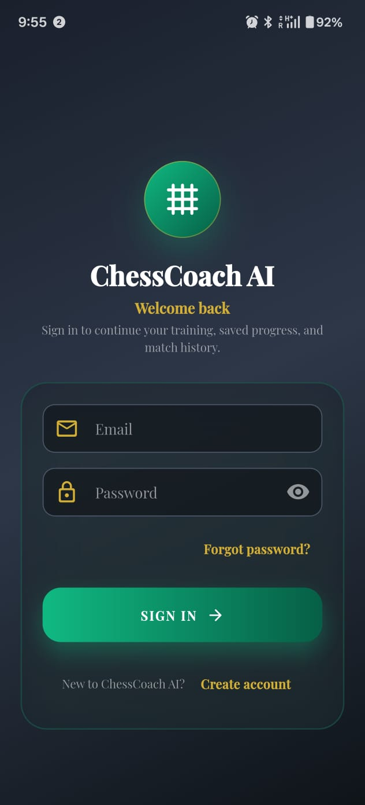
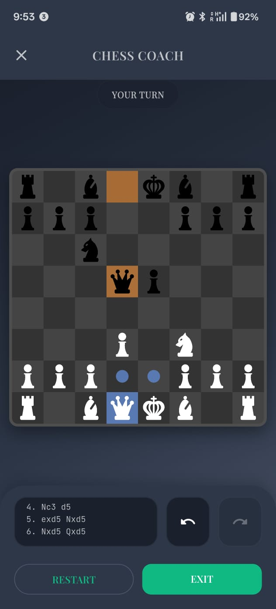
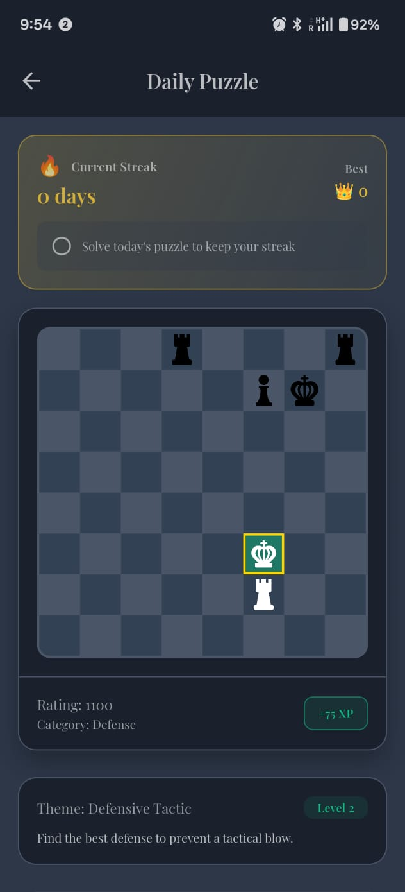
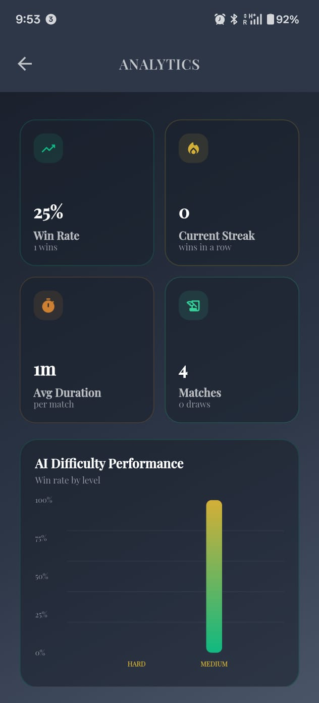
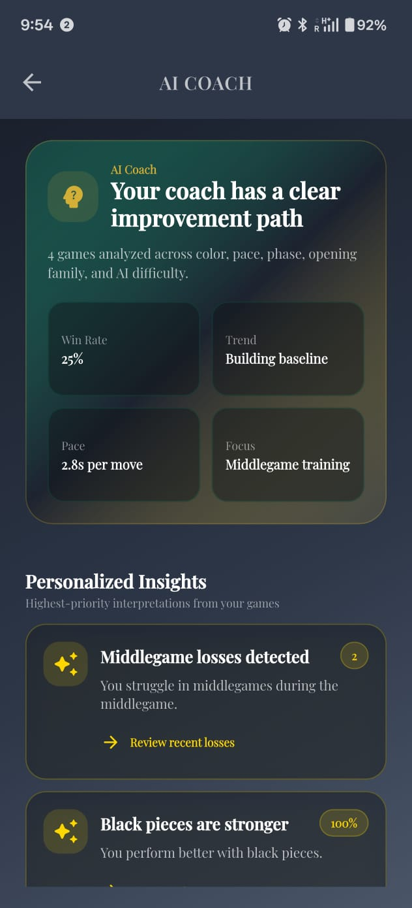

# ChessCoach AI

ChessCoach AI is a Flutter chess training app that combines a playable chess engine, Flame-powered board rendering, Firebase-backed accounts, offline-first data sync, daily tactical puzzles, match analytics, replay review, and personalized AI coach insights.

The app started as a polished local chess game and has grown into a mobile training companion for players who want to play, review, and improve from the same place.

## Screenshots

Place screenshots in `assets/screenshots/` using the filenames shown below. These paths are already referenced by the README so they will render automatically on GitHub once the images are added.

<table>
  <tr>
    <td width="33%" align="center">
      <br/>
      <b>Authentication</b><br/>
      Email sign in, password reset, and account creation.
    </td>
    <td width="33%" align="center">
      <br/>
      <b>Gameplay</b><br/>
      Flame-rendered board, move hints, move history, restart, and exit controls.
    </td>
    <td width="33%" align="center">
      <br/>
      <b>Daily Puzzle</b><br/>
      Tactical puzzle board with streak, XP, rating, category, and level metadata.
    </td>
  </tr>
  <tr>
    <td width="33%" align="center">
      <br/>
      <b>Analytics</b><br/>
      Win rate, streaks, match totals, average duration, and difficulty performance charts.
    </td>
    <td width="33%" align="center">
      <br/>
      <b>AI Coach</b><br/>
      Personalized performance summary, trends, focus areas, and improvement insights.
    </td>
    <td width="33%" align="center">
      <b>More Screens</b><br/>
      Add match history, replay review, settings, and puzzle results as the UI evolves.
    </td>
  </tr>
</table>

## Highlights

- Play chess against the built-in AI or a local two-player opponent.
- Choose from 5 AI difficulty levels.
- Configure side selection, time controls, sound, hints, notation, board rotation, and undo/redo.
- Render the board and pieces with Flame.
- Persist settings, saved games, and cached training data locally.
- Sign in with Firebase Auth.
- Sync profile, match history, analytics, coach reports, and puzzle progress with Cloud Firestore.
- Keep using cached data while offline, then sync when connectivity returns.
- Review analytics, replay timelines, critical moments, and post-game feedback.
- Train with daily puzzles, XP rewards, streaks, hints, tiers, and progress history.
- Customize the board and pieces with bundled themes.

## Feature Set

### Chess Gameplay

- Single-player games against the built-in chess AI.
- Offline two-player mode on the same device.
- White, black, or random side selection.
- Optional time controls.
- Legal move validation, check, checkmate, stalemate, and promotion handling.
- Move history with notation support.
- Undo and redo support when enabled.
- Visual move hints, latest-move highlights, check indicators, and optional board coordinates.
- Resume support for saved games.
- Audio feedback for moves and game outcomes.

### Chess AI

- 5 difficulty levels.
- Minimax search with alpha-beta pruning.
- Iterative deepening and move ordering.
- Quiescence search for tactical stability.
- Null move pruning and late move reductions.
- Transposition table support.
- Piece-square tables and opening book support.

Core AI implementation lives in:

```text
lib/logic/move_calculation/
```

### Daily Puzzle System

- Daily puzzle rotation.
- UCI move validation.
- Multi-move puzzle progress tracking.
- Tactical themes such as checkmate, fork, pin, skewer, discovered attack, sacrifice, defense, and endgame tactics.
- Difficulty-based XP rewards.
- Streak tracking and streak bonuses.
- Tier progression from beginner levels toward advanced ranks.
- Hint system with up to 3 hints per puzzle.
- Puzzle result screen, history, and performance analytics.
- Firestore-backed attempt and progress persistence.

Important files:

```text
lib/puzzles/
lib/models/puzzle_*.dart
lib/providers/puzzle_provider.dart
lib/screens/puzzles/
lib/widgets/puzzles/
```

### Analytics And Match History

- Total matches, wins, losses, draws, and win rate.
- Current streak tracking.
- Average game duration.
- Recent match list.
- Match metadata for game mode, AI difficulty, player color, duration, move count, result, opening family, and move history.
- Cached analytics for offline viewing.
- Firestore analytics summary persistence.

Important files:

```text
lib/models/analytics_model.dart
lib/providers/analytics_provider.dart
lib/providers/match_history_provider.dart
lib/screens/analytics/
lib/widgets/analytics/
```

### AI Coach

- Personalized performance summary cards.
- Strengths, weaknesses, tendencies, and recommendations.
- Opening, pace, aggression, defense, and game-phase observations.
- Cached coach insights for offline access.
- Firestore persistence with sync queue fallback.
- Dashboard and action screens for training guidance.

Important files:

```text
lib/ai_coach/
lib/providers/ai_coach_provider.dart
lib/providers/realtime_coach_provider.dart
lib/screens/coach/
lib/widgets/coach/
```

### Replay And Post-Game Review

- Move timeline.
- Replay controls.
- Evaluation graph.
- Critical moment cards.
- Review summary cards.
- Move quality classification.
- Post-game analysis with accuracy, blunders, mistakes, best-move streak, strongest phase, weakest phase, and coach summary.

Important files:

```text
lib/replay/
lib/providers/replay_provider.dart
lib/screens/replay/
lib/widgets/replay/
```

### Authentication, Cloud Sync, And Offline Support

- Firebase initialization at app startup.
- Firebase Auth email/password sign up, sign in, sign out, and password reset.
- Cloud Firestore profile, match history, analytics, coach, and puzzle data.
- Firestore local persistence with unlimited cache.
- SharedPreferences cache for user profile, match history, analytics, puzzle progress, coach insights, replay data, settings, and sync queue.
- Connectivity polling and offline UI.
- Retry and no-connection components.
- Sync queue for actions that fail while offline.

Important files:

```text
lib/firebase/
lib/providers/auth_provider.dart
lib/providers/connectivity_provider.dart
lib/services/
lib/widgets/shared/offline_banner.dart
lib/widgets/shared/sync_status_indicator.dart
```

## Customization

Board themes:

- Amoled
- Cherry Funk
- Dark
- Grey
- Jargon Jade
- Lewis
- Sage
- Warm Tan

Piece themes:

- 8-Bit
- Angular
- Classic
- Letters
- Lewis Chessmen
- Mexico City
- Video Chess

User preferences are saved locally with SharedPreferences, including app theme, piece theme, move history visibility, sound, hints, board notation, board rotation, undo/redo availability, and basic local stats.

## Technology Stack

- Flutter and Dart
- Flame for 2D chess board rendering
- Provider for application state
- Firebase Core
- Firebase Auth
- Cloud Firestore
- SharedPreferences for local persistence
- Flame Audio for sound effects
- fl_chart for analytics and review charts
- Google Fonts and bundled Jura font
- Confetti for completion feedback

## Project Structure

```text
lib/
  main.dart                         App startup, Firebase, Flame assets, providers
  core/theme/                       App colors, typography, and shared theme system
  firebase/                         Auth and Firestore service layer
  logic/                            Chess engine, board, game controller, timers, audio
  logic/move_calculation/           Move generation and chess AI
  models/                           App, user, match, analytics, puzzle, coach, replay models
  providers/                        Provider-backed application state
  screens/                          Main screens and feature screens
  widgets/                          Reusable and feature-specific UI components
  puzzles/                          Daily puzzle engine, generator, validator, progress tracker
  ai_coach/                         Coaching and move analysis engines
  replay/                           Replay timeline and post-game analysis engines

assets/
  audio/                            Move and result sound effects
  font/                             Jura font
  icons/                            Launcher icon assets
  images/                           Logo and chess piece themes
  screenshots/                      README screenshots

android/                            Android platform project
ios/                                iOS platform project
```

## App Startup Flow

1. Flutter bindings initialize.
2. Portrait orientation is locked.
3. Firebase initializes from `lib/firebase_options.dart`.
4. Firestore offline persistence is enabled.
5. Flame preloads chess piece sprites and audio assets.
6. Providers are registered through `MultiProvider`.
7. `AuthGate` decides whether to show authentication screens or the main app.
8. `OfflineBanner` wraps the app and reports connectivity state.

## Setup

### Prerequisites

- Flutter SDK with Dart 3.0 or newer.
- Android Studio or Xcode for platform builds.
- A configured Firebase project for Auth and Firestore.
- Platform Firebase config files:
  - `android/app/google-services.json`
  - iOS Firebase configuration through `lib/firebase_options.dart` and the iOS runner setup.

### Install Dependencies

```bash
flutter pub get
```

### Run The App

```bash
flutter run
```

### Analyze The Project

```bash
flutter analyze
```

### Build Android

```bash
flutter build apk --release
```

For signed release builds, configure `android/key.properties` with the release keystore values expected by `android/app/build.gradle`.

### Build iOS

```bash
flutter build ios --release
```

Open the iOS project in Xcode for signing and distribution settings when needed.

## Firebase Data Model

Firestore stores user data under:

```text
users/{userId}
  match_history/{matchId}
  analytics/summary
  coach_insights/{insightId}
  ai_coach/summary
  puzzle_attempts/{attemptId}
  puzzles/progress
```

## Development Notes

- Global application state should stay in Provider-backed classes, especially `AppModel`.
- Chess rule and AI changes should be kept inside `lib/logic/`.
- Minimax depth, alpha-beta pruning, move generation, transposition tables, and pruning optimizations should be handled carefully.
- New piece themes must be added to `PIECE_THEMES` in `lib/models/user_preferences.dart`, placed under `assets/images/pieces/<theme_name>/`, and included in `pubspec.yaml`.
- Do not remove undo/redo, timers, difficulty levels, or saved-game behavior unless intentionally changing the product scope.
- Keep Dart files formatted with `dart format`.

## Roadmap Ideas

- Expand the puzzle database beyond bundled sample puzzles.
- Add leaderboard and challenge modes.
- Add richer engine-backed move recommendations.
- Add cloud device-to-device saved-game resume.
- Add achievement badges.
- Add deeper opening classification.
- Add automated tests around move validation, AI search, puzzle validation, sync, and analytics.

## Repository Notes

- Package name: `en_passant`
- Application title: `ChessCoach AI`
- Android application id: `com.harshvardhan.chesscoachai`
- Current app version: `1.0.2+3`
